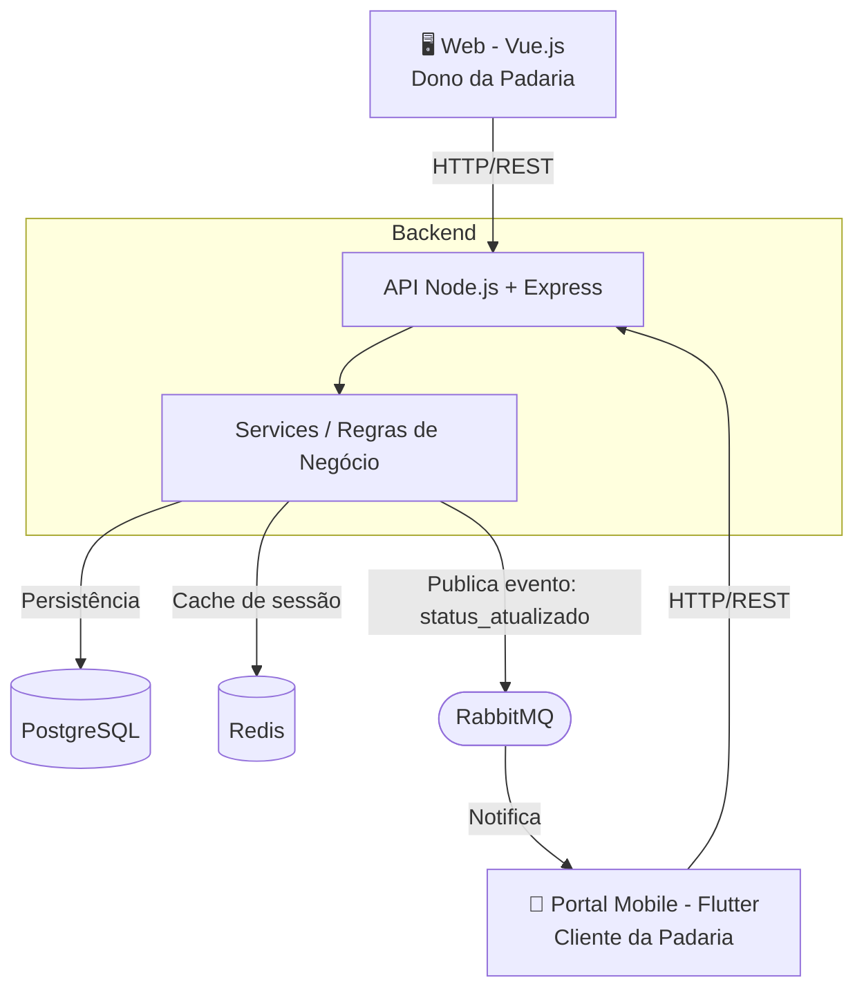

# Proposta de Domínio — Sprint 1

**Disciplina:** Lab. de Desenvolvimento de Aplicações Móveis e Distribuídas
**Aluno:** Marcus Vinícius
**Curso:** Engenharia de Software — 5º Período
**Semestre:** 1º Semestre 2026

---

## 1. Descrição do Domínio

O sistema proposto é uma plataforma de gestão de pedidos para uma **padaria artesanal**. O problema central é a ausência de um canal digital entre o estabelecimento e seus clientes: hoje os pedidos são anotados manualmente, o que gera erros, retrabalho na produção e falta de visibilidade para o cliente sobre o status do seu pedido.

A solução digitaliza esse fluxo: o dono registra os pedidos no sistema e o cliente acompanha em tempo real pelo portal, sem precisar ligar ou comparecer ao estabelecimento.

---

## 2. Perfis de Usuário

### Dono da Padaria (Prestador de Serviço)
Responsável por operar o sistema. Registra os pedidos recebidos, gerencia produtos e clientes, e atualiza o status de cada pedido ao longo do processo de produção e entrega.

**Ações principais:**
- Cadastrar e gerenciar produtos
- Registrar pedidos de clientes
- Atualizar o status do pedido (ex.: em produção, pronto, entregue)
- Visualizar lista de produção do dia

### Cliente da Padaria (Usuário Final)
Acessa um portal via número de telefone para acompanhar o andamento do seu pedido, sem necessidade de cadastro ou senha.

**Ações principais:**
- Acessar o portal informando o número de telefone
- Visualizar pedidos vinculados ao seu número
- Acompanhar o status atualizado do pedido em tempo real

---

## 3. Principais Funcionalidades

| Funcionalidade              | Perfil          |
|-----------------------------|-----------------|
| Cadastro de produtos        | Dono            |
| Cadastro de clientes        | Dono            |
| Registro de pedidos         | Dono            |
| Atualização de status       | Dono            |
| Geração de lista de produção| Dono            |
| Gestão de pagamentos        | Dono            |
| Consulta de pedidos         | Cliente         |
| Acompanhamento de status    | Cliente         |

---

## 4. Justificativa

A escolha deste domínio se justifica pela aderência aos requisitos arquiteturais da disciplina:

- **Dois perfis distintos:** dono (prestador) e cliente final, com fluxos independentes
- **Comunicação assíncrona:** mudanças de status do pedido serão publicadas via MOM (RabbitMQ), notificando o portal do cliente sem necessidade de polling manual
- **Arquitetura distribuída:** backend REST em Node.js, portal web em Vue.js, app mobile em Flutter e banco de dados PostgreSQL, todos integrados por eventos

O domínio é real — o sistema será utilizado por uma padaria em operação — o que agrega valor prático ao projeto além do acadêmico.

---

## 5. Visão Geral da Arquitetura




---

## 6. Como Rodar e Testar o Projeto

### Pré-requisitos
- [Node.js 20+](https://nodejs.org/)
- [Docker Desktop](https://www.docker.com/products/docker-desktop/)

### 1. Clonar o repositório

```bash
git clone https://github.com/mviniccius/Micro-Saas.git
cd Micro-Saas
```

### 2. Subir o banco de dados

```bash
cd Back
docker compose up database -d
```

### 3. Configurar variáveis de ambiente

Crie o arquivo `Back/.env` com o conteúdo abaixo:

```env
DB_HOST=localhost
DB_PORT=5432
DB_USER=postgres
DB_PASSWORD=123
DB_NAME=padaria
```

### 4. Instalar dependências e iniciar o servidor

```bash
npm install
npm run dev
```

Servidor disponível em: `http://localhost:3000`
Documentação Swagger: `http://localhost:3000/api-docs`

---

### 5. Testar os endpoints

Importe o arquivo `colecao-postman.json` (na mesma pasta desta proposta) no **Postman** e execute na ordem:

| Passo | Método | Rota | Descrição |
|-------|--------|------|-----------|
| 1 | POST | `/produtos` | Cadastrar um produto |
| 2 | POST | `/clientes` | Cadastrar um cliente |
| 3 | POST | `/pedidos` | Criar pedido vinculando cliente e produto |
| 4 | GET | `/pedidos` | Listar todos os pedidos (visão do dono) |
| 5 | GET | `/pedidos/telefone/:telefone` | Consultar pedidos pelo telefone (portal do cliente) |
