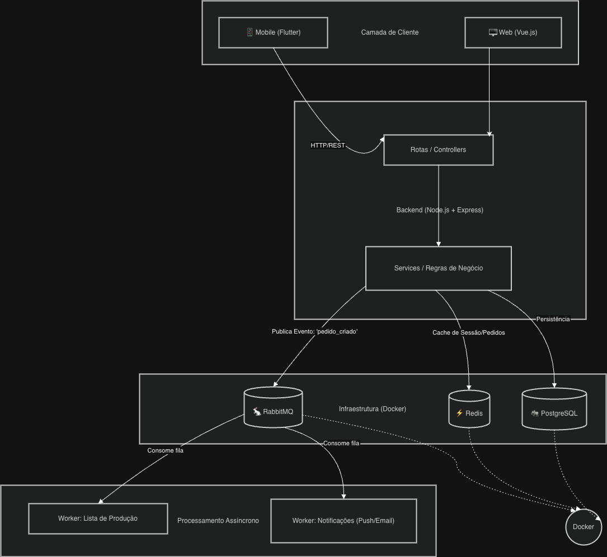
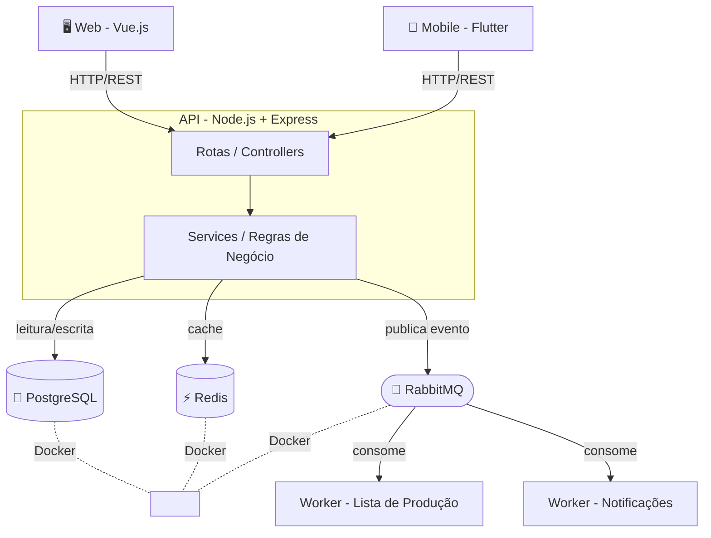

# Sistema de Gestão Interna

Sistema interno para gestão de pedidos, produção e pagamentos. Usado por funcionários da empresa para registrar pedidos de clientes, gerar listas de produção e controlar recebimentos.

---

## Arquitetura





---

## Tecnologias

| Camada      | Tecnologia         |
|-------------|--------------------|
| Backend     | Node.js + Express  |
| Frontend    | Vue.js             |
| Mobile      | Flutter            |
| Banco       | PostgreSQL         |
| Cache       | Redis              |
| Mensageria  | RabbitMQ           |
| Infra       | Docker             |

---

## Estrutura do Projeto

```
Micro-Saas/
├── Back/               # API REST (Node.js)
│   ├── controllers/    # Lógica de entrada/saída
│   ├── service/        # Regras de negócio e queries
│   ├── routers/        # Definição de rotas
│   ├── database/       # Conexão com PostgreSQL
│   ├── db/init.sql     # Schema do banco
│   ├── swagger.js      # Documentação da API
│   └── compose.yaml    # Docker (banco + pgAdmin)
├── front/              # Frontend Vue.js
└── mobile/             # App Flutter (em breve)
```

---

## Como rodar localmente

### Pré-requisitos
- Node.js 20+
- Docker Desktop

### Backend

```bash
# 1. Subir o banco de dados
cd Back
docker compose up database -d

# 2. Instalar dependências
npm install

# 3. Configurar variáveis de ambiente
cp .env.example .env

# 4. Rodar o servidor
npm run dev
```

API disponível em: `http://localhost:3000`
Documentação Swagger: `http://localhost:3000/api-docs`

### Frontend

```bash
cd front
npm install
npm run dev
```

---

## Variáveis de Ambiente

Crie um arquivo `.env` na pasta `Back/` com:

```env
DB_HOST=localhost
DB_PORT=5432
DB_USER=postgres
DB_PASSWORD=123
DB_NAME=padaria
```

---

## Fases do Projeto

- [x] **Fase 1** — Cadastro de clientes, produtos, pedidos e gestão de pagamentos
- [ ] **Fase 2** — Login por perfil (atendente, separador, financeiro) e anotações de separação
